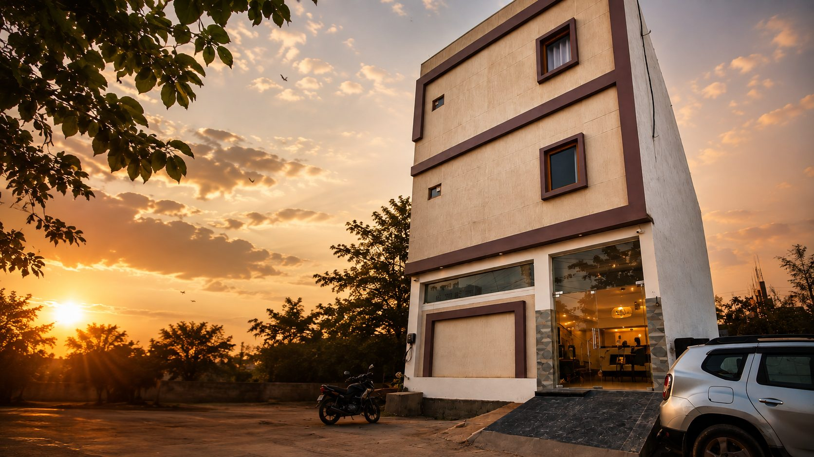

# RK Dham Residency — Official Website
A high-performance, responsive luxury budget hotel landing page designed for **RK Dham Residency**, located in Rukmini Vihar, Vrindavan, Uttar Pradesh.

---
## 🌟 Features
* **Modern Design & Typography:** Crafted with a curated color palette (Warm Ivory, Gold, Deep Maroon, Dark Brown) using *Playfair Display* and *Inter* Google Fonts.
* **Direct WhatsApp Bookings:** Integrated interactive booking request form that validates check-in/check-out dates and forwards structured reservation details directly to WhatsApp (+91 99901 23888).
* **Smooth Animations & Scroll:** Powered by **GSAP (ScrollTrigger)** and **Lenis** smooth scroll for smooth micro-interactions.
* **Responsive Layout:** Tailored for mobile, tablet, and desktop devices.
* **Interactive Lightbox & Gallery:** Highlighting hotel rooms, amenities, and nearby attractions (Prem Mandir, Banke Bihari, ISKCON).
* **SEO & Rich Snippets:** Built-in Schema.org `Hotel` JSON-LD structured data, Open Graph tags, and Twitter Cards for search engines and social previews.
* **Security & Performance:** Built with clean, dependency-free vanilla frontend code with safe link targets (`rel="noopener noreferrer"`).
---
## 📁 File Structure
```text
/
├── index.html        # Main HTML structure, metadata & Schema.org JSON-LD
├── style.css         # Custom CSS tokens, layouts, animations & responsive breakpoints
├── script.js        # JavaScript interactions (Lenis, GSAP, Lightbox, Form Handler)
├── exterior.jpg      # Hotel building exterior image asset
└── README.md         # Project documentation & setup guide
```
---
## 🚀 How to Run Locally
1. Clone or download this repository to your local machine.
2. Open `index.html` directly in any modern web browser.
3. Alternatively, serve via a local HTTP server using VS Code Live Server or Python:
   ```bash
   # Using Python 3
   python3 -m http.server 8000
   ```
   Then open `http://localhost:8000` in your browser.
---
## 🌐 Deployment Instructions
Aap is website ko kisi bhi static web hosting service par free deploy kar sakte hain:
### Option 1: Netlify
1. Go to [Netlify](https://www.netlify.com/).
2. Drag and drop the workspace folder into the Netlify dashboard.
3. Netlify will provide an instant HTTPS live link.
### Option 2: Vercel
1. Install Vercel CLI: `npm i -g vercel`
2. Run `vercel` in the project folder and follow the prompts.
### Option 3: Hostinger / Shared Hosting (cPanel)
1. Zip all files (`index.html`, `style.css`, `script.js`, `exterior.jpg`).
2. Upload and extract inside the `public_html` directory via File Manager.
---
## ⚙️ Customization & Updates
* **Update Contact & WhatsApp Number:**
  Search for `9990123888` in `index.html` and `script.js` to change the phone number.
* **Update Room Prices:**
  Modify the room pricing inside `<div class="room-price">` in `index.html`.
* **Update Address / Email:**
  Update the address and email (rkdhamresidency@gmail.com) in `index.html`.
---
## 🔒 Security Best Practices
- Enforce **HTTPS** on your hosting domain.
- Ensure 2-Factor Authentication (2FA) is enabled on your domain registrar and web hosting accounts.
---
© 2026 RK Dham Residency. All Rights Reserved.


